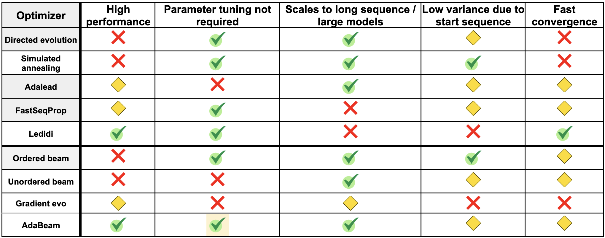

## NucleoBench

[](https://codecov.io/gh/move37-labs/nucleobench)
[](https://badge.fury.io/py/nucleobench)
[](https://pypi.org/project/nucleobench/)
[](https://github.com/move37-labs/nucleobench/blob/main/LICENSE)
[](https://www.biorxiv.org/content/10.1101/2025.06.20.660785)
[](https://github.com/move37-labs/nucleobench/blob/main/environment.yml)
[](https://hub.docker.com/r/joelshor/nucleobench)
[](https://github.com/move37-labs/nucleobench/pkgs/container/nucleobench)

| Environment  | Unit Tests | Docker Integration Tests |
| :--- | :--- | :--- |
| **Micromamba** | [](https://github.com/move37-labs/nucleobench/actions/workflows/unit-tests-in-micromamba.yml) | [](https://github.com/move37-labs/nucleobench/actions/workflows/docker-integration-tests-in-micromamba.yml) |
| **GHCR** | [](https://github.com/move37-labs/nucleobench/actions/workflows/unit-tests-in-docker-github.yml) | [](https://github.com/move37-labs/nucleobench/actions/workflows/docker-integration-tests-in-docker-github.yml) |

### Model Integration Tests (Micromamba)
[](https://github.com/move37-labs/nucleobench/actions/workflows/enformer-integration-tests-in-micromamba.yml)

**A large-scale benchmark for modern nucleic acid sequence design algorithms (NucleoBench), and a new design algorithm that outperforms existing designers (GrAdaBeam).  Link to ICML GenBio 2025 workshop paper [here](https://www.biorxiv.org/content/10.1101/2025.06.20.660785).**

[comment]: <> (Consider an image here.)

This repo is intended to be used in a few ways:
1. Design a DNA sequence with selective expression in a cell-type (or any other target property in the benchmark, see list [here](#summary-of-tasks-in-nucleobench)), using the GrAdaBeam algorithm (or any of the ones listed [here](#summary-of-designers-in-nucleobench))
2. Design a DNA sequence with high binding affinity for a specific transcription factor (such as the ones listed [here](#summary-of-tasks-in-nucleobench)), using the GrAdaBeam algorithm (or any of the ones listed [here](#summary-of-designers-in-nucleobench))
1. Design a DNA or RNA sequence for a new task, using any designer (see tutorial [here](https://github.com/move37-labs/nucleobench/blob/main/recipes/colab/custom_task.ipynb))
1. Run a new design algorithm on NucleoBench tasks.
1. Reproduce the NucleoBench results, using the standard tasks / designers or using your custom ones, on the Cloud using Google Batch or AWS (instructions [here](#get-started-in-8-minutes-google-batch-inference))


### Citation

Please cite the following publication when referencing NucleoBench or GrAdaBeam:

```
@article{shor2025nucleobench,
  author    = {Shor, Joel and Strand, Erik and McLean, Cory Y.},
  title     = {{GrAdaBeam: Combining model gradients with evolutionary search for generalizable nucleic acid design}},
  journal   = {bioRxiv},
  year      = {2026},
  doi       = {10.1101/2025.06.20.660785},
  url       = {https://www.biorxiv.org/content/10.1101/2025.06.20.660785}
}
```

## Contents

- [Quick Start](#quick_start)
  - [1 minute install w/ pip](#get-started-in-1-minute-pip-install)
  - [5 minute install w/ source](#get-started-in-5-minutes-git-clone)
  - [8 minute install w/ Google Batch inference](#get-started-in-8-minutes-google-batch-inference)
- [Details](#details)
- [FAQ](#faq)

## Quick Start

NucleoBench is provided via **PyPi** or **source**.

### Get started in 1 minute (pip install)

Install `nucleobench` on your terminal:
```bash
# Standard / GPU install:
pip install nucleobench

# CPU-only install (forces PyTorch to use CPU version):
pip install nucleobench --extra-index-url https://download.pytorch.org/whl/cpu
```

Then run in Python:
```python
# 1. Choose a model (task).
from nucleobench import models
model = models.get_model('substring_count')
model_init_args = model.debug_init_args()
model_init_args['substring'] = 'ATGTC'
model_fn = model(**model_init_args)

# 2. Choose an optimizer.
from nucleobench import optimizations
opt_obj = optimizations.get_optimization('gradabeam')
opt_init_args = opt_obj.debug_init_args()
opt_init_args['model_fn'] = model_fn
opt_init_args['start_sequence'] = 'A' * 100
designer = opt_obj(**opt_init_args)

# 3. Run the designer and show the results.
designer.run(n_steps=100)
ret = designer.get_samples(1)
ret_score = model_fn(ret)
print(f'Final score: {ret_score[0]}')
print(f'Final sequence: {ret[0]}')
```

Output:
```bash
Final score: -535.0
Final sequence: ATGTCTGTCTATGTCATGTCATGTCATGTCATGTCATGTCTCTATGTCATGTCTATGTCTATGTCTATGTCATGTCATGTCTGTCTATGTCATGTATGTC
```

This "recipe" can be found under [`recipes/python/gradabeam_substringcount.py`](https://github.com/move37-labs/nucleobench/blob/main/recipes/python/gradabeam_substringcount.py).

### Get started in 5 minutes (git clone)

```bash
git clone https://github.com/move37-labs/nucleobench.git
cd nucleobench
conda env create -f environment.yml
conda activate nucleobench
```

Now run the main entrypoint:

```bash
python -m docker_entrypoint \
    --model substring_count \
        --substring 'ATGTC' \
    --optimization gradabeam \
        --beam_size 2 \
        --n_rollouts_per_root 4 \
        --mutations_per_sequence 2 \
        --exploration_alpha 0.05 \
        --rng_seed 0 \
    --max_seconds 15 \
    --optimization_steps_per_output 5 \
    --proposals_per_round 2 \
    --output_path ./output/python_recipe/gradabeam_substringcount \
    --start_sequence AAAAAAAAAAAAAAAAAAAAAAAAAAAAAAAAAAAA
```

Output:
```bash
...
Completed round 1839 (5 steps) took 0.01s. Avg 0.00s per step.
  0%|                                     | 1840/99999999 [00:14<226:20:41, 122.72it/s]
Proposals deposited at:
    ./output/python_recipe/gradabeam_substringcount/gradabeam_substring_count/20260725_180740/20260725_180755.parquet
```

This "recipe" can be found under [`recipes/python/gradabeam_atac.sh`](https://github.com/move37-labs/nucleobench/blob/main/recipes/python/gradabeam_atac.sh).

### Get started in 8 minutes (Google Batch inference)

Google Batch is Google's cheapest batch compute offering. It enables relatively cheap parallel compute on the cloud.

First, setup a Google Cloud project by following instructions [here](https://cloud.google.com/batch). You will need to activate the Google Batch API. If you want the job to write to a private bucket, you will also need to setup what's called a "Service Account" with the proper permissions. Once you have done this, you will need to collect the following information from your new project, and fill this information in [runners/gcp/config.py](https://github.com/move37-labs/nucleobench/blob/main/runners/gcp/config.py):

1. PROJECT_ID (the project ID of the project you created above)
1. REGION (the region of the project)
1. BUCKET_NAME (the bucket of the output)
1. SERVICE_ACCOUNT_EMAIL (option: a service account for security)

Next, create the conda environment to launch jobs to the Cloud runner:
```bash
conda env create -f runners/environment.yml
```
Output:
```bash
Transaction finished

To activate this environment, use:

    conda activate runners

Or to execute a single command in this environment, use:

    conda run -n runners mycommand
```

Now run the dry run Google Batch job with the test script:

```bash
conda activate runners
python -m runners.gcp.job_launcher \
    --dry-run \
    --verbose \
    runners/testdata/adabeam_test.tsv
```

Output:
```bash
2025-08-28 18:00:21,651 - INFO - Row 1: Generated job name: bpnet-rad21-adabeam-001
2025-08-28 18:00:21,651 - INFO - Loaded 1 jobs from runners/testdata/adabeam_test.tsv
2025-08-28 18:00:21,651 - INFO - DRY RUN MODE - No jobs will be launched
2025-08-28 18:00:21,651 - INFO - Would launch job: bpnet-rad21-adabeam-00120250828-18-00-21
```

Now run the real job:
```bash
python -m runners.gcp.job_launcher \
    --verbose \
    runners/testdata/adabeam_test.tsv
```

Output:
```bash
2025-08-28 18:01:32,909 - INFO - Row 1: Generated job name: bpnet-rad21-adabeam-001
2025-08-28 18:01:32,909 - INFO - Loaded 1 jobs from runners/testdata/adabeam_test.tsv
2025-08-28 18:01:32,910 - DEBUG - Checking None for explicit credentials as part of auth process...
2025-08-28 18:01:32,910 - DEBUG - Checking Cloud SDK credentials as part of auth process...
2025-08-28 18:01:33,528 - DEBUG - Starting new HTTPS connection (1): oauth2.googleapis.com:443
2025-08-28 18:01:33,708 - DEBUG - https://oauth2.googleapis.com:443 "POST /token HTTP/1.1" 200 None
2025-08-28 18:01:34,087 - INFO - Successfully launched job: projects/nucleorave/locations/us-central1/jobs/bpnet-rad21-adabeam-00120250828-18-01-32
2025-08-28 18:01:34,087 - INFO - 
Job Launch Summary:
2025-08-28 18:01:34,087 - INFO - Successful: 1
2025-08-28 18:01:34,087 - INFO - Failed: 0
2025-08-28 18:01:34,087 - INFO - Successful jobs: bpnet-rad21-adabeam-00120250828-18-01-32
```

Finally, make sure that the job completes fully, and the output is in the right bucket.

## Details

We introduce **GrAdaBeam**, a hybrid model-based optimization algorithm that
combines gradient-derived attention maps with an adaptive beam search to navigate complex nucleic acid fitness landscapes. By unifying the broad exploration of evolutionary methods with the precise guidance of gradient descent, GrAdaBeam overcomes a central limitation of existing approaches: no single optimization strategy performs robustly across the full spectrum of genomic design tasks. We rigorously evaluate GrAdaBeam and nine other design algorithms using NucleoBench, a novel benchmark covering 17 diverse genomic tasks that introduces a paired-start-sequence design for superior statistical comparisons. GrAdaBeam statistically outperforms all other algorithms across over 600,000 experiments, never ranking lower than second across all 17 benchmark tasks, while baseline methods often struggle on large models or long sequences. Critically, GrAdaBeam sequences generalize most reliably to independent predictive models and recover canonical transcription factor binding motifs de novo, providing evidence of biological signal capture beyond the optimization target. GrAdaBeam and NucleoBench are freely available as an open-source package.

<div align="center">

</div>

### Comparison of nucleic acid design benchmarks

| NAME | YEAR | ALGOS | TASKS | SEQ. LENGTH (BP) | DESIGN BENCHMARK | LONG SEQS | LARGE MODELS | PAIRED START SEQS. |
| :--- | :--- | :--- | :--- | :--- | :--- | :--- | :--- | :--- |
| Fitness Landscape Exploration Sandbox | 2020 | 4-6 | 9 | Most <100 | ✅ | ❌ | ❌ | ✅ |
| Computational Optimization of DNA Activity | 2024 | 3 | 3 | 200 | ✅ | ❌ | ❌ | ✅ |
| gRelu | 2024 | 2 | 5 | 500K (20 edit) | ❌ | ❌ | ✅ | ❌ |
| Linder et al repos | 2021 | 2 | 20 | <600 | ✅ | ❌ | ❌ | ❌ |
| NucleoBench (ours) | 2025 | 9 | 16 | 256-3K | ✅ | ✅ | ✅ | ✅ |

<small>Table: Nucleic acid design from sequence benchmarks. All benchmarks prior to NucleoBench are limited either in the range of tasks
they measure against, the range of optimizations they compare, or the complexity of the task.</small>

### Summary of tasks in NucleoBench

| TASK CATEGORY | MODEL | DESCRIPTION | NUM TASKS | SEQ LEN (BP) | SPEED (MS / EXAMPLE) |
| :--- | :--- | :--- | :--- | :--- | :--- |
| Cell-type specific cis-regulatory activity | Malinois | How DNA sequences control gene expression from the same DNA molecule. Cell types are: *precursor blood cells*, *liver cells*, *neuronal cells*. | 3 | 200 | 2 |
| Transcription factor binding | BPNet-lite | How likely a specific transcription factor (TF) will bind to a particular stretch of DNA. Specific TFs: *CTCF*, *E2F3*, *ELF4*, *GATA2*, *JUNB*, *MAX*, *MECOM*, *MYC*, *OTX1*, *RAD21*, *SOX6* | 11 | 3000 | 55 |
| Chromatin accessibility | BPNet-lite | How physically accessible DNA is for interactions with other molecules. | 1 | 3000 | 260 |
| Selective gene expression | Enformer | Prediction of gene expression. We optimize for *maximal expression in muscle cells, minimal expression in liver cells*.| 1 | 196,608 / 256 * | 15,000 |

<small>*Input length is 200K, but only 256 bp are edited.</small>

### Summary of designers in NucleoBench

| Algo | Description | Gradient-based |
| :--- | :--- | :--- |
| Directed Evolution | Random mutations, track the best. | ❌ |
| Simulated Annealing | Greedy optimization with random jumps. | ❌ |
| [AdaLead](https://arxiv.org/abs/2010.02141) | Iterative combining and mutating of a population of sequences. | ❌ |
| [FastSeqProp](https://bmcbioinformatics.biomedcentral.com/articles/10.1186/s12859-021-04437-5) | Sampling and the straight-through estimator for maximal input. | ✅ |
| [Ledidi](https://www.biorxiv.org/content/10.1101/2020.05.21.109686v1) | Sampling and the gumbel softmax estimator for maximal input. | ✅ |
| --- |
| Ordered Beam | Greedy search, in fixed sequence order, with cache. | ❌ |
| Unordered Beam | Greedy search with cache. | ❌ |
| Gradient Evo | Directed Evolution, guided by model gradients. | ✅ |
| [AdaBeam (ours)](https://www.biorxiv.org/content/10.1101/2025.06.20.660785) | Hybrid of Unordered Beam and improved AdaLead. | ❌ |

<small>Table: Summary of designers in NucleoBench. Above the solid line are designers already found in the nucleic acid design literature.
Below the line are designers from the search literature not previously used to benchmark nucleic acid sequence design and hybrid
algorithms devised in this work.</small>

## FAQ

1. How can I add a new task to NucleoBench?
    A: Follow [this](https://github.com/move37-labs/nucleobench/blob/main/recipes/colab/custom_task.ipynb) colab notebook.