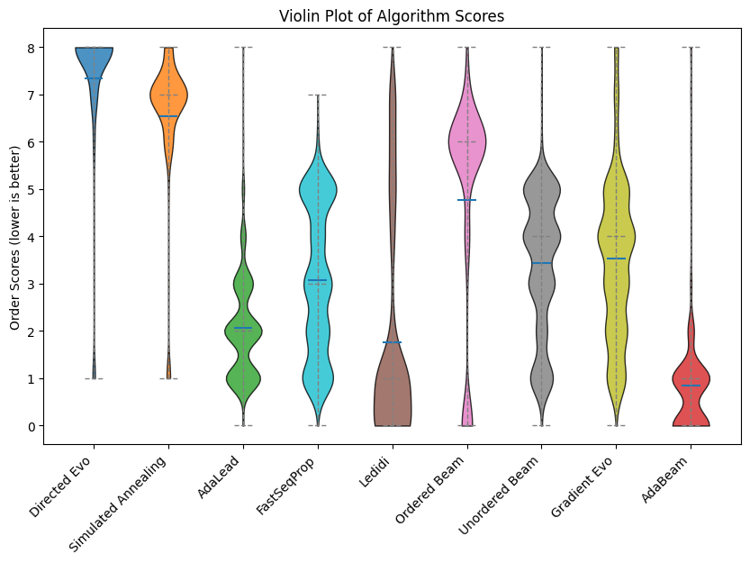

# NucleoBench: A Large-Scale Benchmark of Neural Nucleic Acid Design Algorithms

**A large-scale benchmark for modern nucleic acid sequence design algorithms (NucleoBench), and a new design algorithm that outperforms existing designers (AdaBeam).  Please see [https://github.com/move37-labs/nucleobench](https://github.com/move37-labs/nucleobench) for more details.**

[comment]: <> (Consider an image here.)

We describe NucleoBench and AdaBeam in the paper ["NucleoBench: A Large-Scale Benchmark of Neural Nucleic Acid Design
Algorithms"](https://www.biorxiv.org/content/10.1101/2025.06.20.660785), appearing in the 2025 ICML GenBio Workshop.

This repo is intended to be used in a few ways:
1. Run any of the NucleoBench design algorithms on a new design problem.
1. Run AdaBeam on a new design problem.
1. Run a new design algorithm on NucleoBench tasks, and avoid recomputing performances for existing designers.

## Contents

- [Quick Start](#quick_start)
  - [1 minute install w/ pip](#get-started-in-1-minute-pip-install)
  - [3  minute install w/ docker](#get-started-in-3-minutes-docker-image-pull)
  - [5 minute install w/ source](#get-started-in-5-minutes-git-clone)
  - [Interactive w/ colab](#interactive-tutorial)
- [Details](#details)
- [Citation](#citation)

## Quick Start

NucleoBench is provided via **PyPi**, **Docker**, or **source**.

### Get started in 1 minute (pip install)

Install `nucleobench` on your terminal:
```bash
# Choose one.
pip install nucleobench  # optimizers and tasks
pip install nucleopt  # smaller, faster install for just optimizers
```

Then run in Python:
```python
# 1. Choose a model (task).
from nucleobench import models
model = models.get_model('substring_count')
model_init_args = model.debug_init_args()
model_init_args['substring'] = 'ATGTC'
model_fn = model_obj(**model_init_args)

# 2. Choose an optimizer.
from nucleobench import optimizations
opt_init_args = opt_obj.debug_init_args()
opt_init_args['model_fn'] = model_fn
opt_init_args['start_sequence'] = 'A' * 100
designer = opt_obj(**opt_init_args)

# 3. Run the designer and show the results.
designer.run(n_steps=100)
ret = designer.get_samples(1)
ret_score = model_fn(ret)
print(f'Final score: {ret_score[0]}')
print(f'Final sequence: {ret[0]}')
```

Output:
```bash
Step 99 current scores: [np.float64(508.0), np.float64(507.0), np.float64(506.0), np.float64(505.0), np.float64(504.0), np.float64(503.0), np.float64(503.0), np.float64(502.0), np.float64(502.0), np.float64(502.0)]
Final score: -508.0
Final sequence: AGATGTCATATATGATGTCATGTCATGTCGTCATGTCTGTCTCTCATGTATGTCATGTCTATGTCTGTCTATGTCTATGTCTATGTCATGTCTATGTCTC
```

This "recipe" can be found under [`recipes/python/adabeam_substring.py`](https://github.com/move37-labs/nucleobench/blob/main/recipes/python/adabeam_substringcount.py).

### Get started in 3 minutes (docker image pull)

Get the image:
```bash
docker image pull joelshor/nucleobench:latest
```

Output:
```bash
latest: Pulling from joelshor/nucleobench
Digest: sha256:602230b568c0f15acfa7a0b6723ffb16fab6f32c37ae5b88c71763fb722ab5c3
Status: Image is up to date for joelshor/nucleobench:latest
docker.io/joelshor/nucleobench:latest
```

Make a directory for output:
```bash
readonly output="./output/docker_recipe/adabeam_atac"
mkdir -p "${output}"
readonly fullpath="$(realpath $output)"
```

Then run it:
```bash
docker run \
    -v "${fullpath}":"${fullpath}" \
    joelshor/nucleobench:latest \
    --model substring_count \
        --substring 'ATGTC' \
    --optimization adabeam \
        --beam_size 2 \
        --n_rollouts_per_root 4 \
        --mutations_per_sequence 2 \
        --rng_seed 0 \
    --max_seconds 15 \
    --optimization_steps_per_output 5 \
    --proposals_per_round 2 \
    --output_path ${fullpath} \
    --start_sequence AAAAAAAAAAAAAAAAAAAAAAAAAAAAAAAAAAAA
```

Output:
```bash
Completed round 3441 (5 steps) took 0.00s. Avg 0.00s per step.
Proposals deposited at:
	/Users/joelshor/Desktop/docker_test/output/docker_recipe/adabeam_atac/adabeam_substring_count/20250731_194857/20250731_194912.pkl
```

This "recipe" can be found under [`recipes/docker/adabeam_atac.sh`](https://github.com/move37-labs/nucleobench/blob/main/recipes/docker/adabeam_atac.sh).

### Get started in 5 minutes (git clone)

```bash
git clone https://github.com/move37-labs/nucleobench.git
cd nucleobench
conda env create -f environment.yml
conda activate nucleobench
```

Now run the main entrypoint:

```bash
python -m docker_entrypoint \
    --model substring_count \
        --substring 'ATGTC' \
    --optimization adabeam \
        --beam_size 2 \
        --n_rollouts_per_root 4 \
        --mutations_per_sequence 2 \
        --rng_seed 0 \
    --max_seconds 15 \
    --optimization_steps_per_output 5 \
    --proposals_per_round 2 \
    --output_path ./output/python_recipe/adabeam_atac \
    --start_sequence AAAAAAAAAAAAAAAAAAAAAAAAAAAAAAAAAAAA
```

Output:
```bash
...
Completed round 3820 (5 steps) took 0.00s. Avg 0.00s per step.
  0%|                              | 3821/99999999 [00:14<109:01:33, 254.77it/s]
Proposals deposited at:
	./output/python_recipe/adabeam_atac/adabeam_substring_count/20250731_162119/20250731_162134.pkl
```

This "recipe" can be found under [`recipes/python/adabeam_atac.py`](https://github.com/move37-labs/nucleobench/blob/main/recipes/python/adabeam_atac.py).

### Interactive tutorial
- Convert the existing `recipes/colab/pypi_substring_counting.ipynb` into a comprehensive tutorial
- Add more Jupyter notebooks for each model type (BPNet, Enformer, etc.)
- Create a "Getting Started" notebook that covers all basic concepts

## Details

**NucleoBench** is a large-scale comparison of modern sequence design algorithms across 16 biological tasks (such as transcription factor binding and gene expression) and 9 design algorithms. NucleoBench, compares design algorithms on the same tasks and start sequences across more than 400K experiments, allowing us to derive unique modeling insights on the importance of using gradient information, the role of randomness, scaling properties, and reasonable starting hyperparameters on new problems. We use these insights to present a novel hybrid design algorithm, **AdaBeam**, that outperforms existing algorithms on 11 of 16 tasks and demonstrates superior scaling properties on long sequences and large predictors. Our benchmark and algorithms are freely available online.



### Comparison of nucleic acid design benchmarks

| NAME | YEAR | ALGOS | TASKS | SEQ. LENGTH (BP) | DESIGN BENCHMARK | LONG SEQS | LARGE MODELS | PAIRED START SEQS. |
| :--- | :--- | :--- | :--- | :--- | :--- | :--- | :--- | :--- |
| Fitness Landscape Exploration Sandbox | 2020 | 4-6 | 9 | Most <100 | ✅ | ❌ | ❌ | ✅ |
| Computational Optimization of DNA Activity | 2024 | 3 | 3 | 200 | ✅ | ❌ | ❌ | ✅ |
| gRelu | 2024 | 2 | 5 | 500K (20 edit) | ❌ | ❌ | ✅ | ❌ |
| Linder et al repos | 2021 | 2 | 20 | <600 | ✅ | ❌ | ❌ | ❌ |
| NucleoBench (ours) | 2025 | 9 | 16 | 256-3K | ✅ | ✅ | ✅ | ✅ |

<small>Table: Nucleic acid design from sequence benchmarks. All benchmarks prior to NucleoBench are limited either in the range of tasks
they measure against, the range of optimizations they compare, or the complexity of the task.</small>

### Summary of tasks in NucleoBench

| TASK CATEGORY | MODEL | DESCRIPTION | NUM TASKS | SEQ LEN (BP) | SPEED (MS / EXAMPLE) |
| :--- | :--- | :--- | :--- | :--- | :--- |
| Cell-type specific cis-regulatory activity | Malinois | How DNA sequences control gene expression from the same DNA molecule. Cell types are: precursor blood cells, liver cells, neuronal cells. | 3 | 200 | 2 |
| Transcription factor binding | BPNet-lite | How likely a specific transcription factor (TF) will bind to a particular stretch of DNA. | 12 | 3000 | 55 / 260** |
| Selective gene expression | Enformer | Prediction of gene expression. | 1 | 196,608 / 256 * | 15,000 |

<small>*Input length is 200K, but only 256 bp are edited. **All models are 55ms except the ATAC model, which is 260.</small>

### Summary of designers in NucleoBench

| Algo | Description | Gradient-based |
| :--- | :--- | :--- |
| Directed Evolution | Random mutations, track the best. | ❌ |
| Simulated Annealing | Greedy optimization with random jumps. | ❌ |
| [AdaLead](https://arxiv.org/abs/2010.02141) | Iterative combining and mutating of a population of sequences. | ❌ |
| [FastSeqProp](https://bmcbioinformatics.biomedcentral.com/articles/10.1186/s12859-021-04437-5) | Sampling and the straight-through estimator for maximal input. | ✅ |
| [Ledidi](https://www.biorxiv.org/content/10.1101/2020.05.21.109686v1) | Sampling and the gumbel softmax estimator for maximal input. | ✅ |
| --- |
| Ordered Beam | Greedy search, in fixed sequence order, with cache. | ❌ |
| Unordered Beam | Greedy search with cache. | ❌ |
| Gradient Evo | Directed Evolution, guided by model gradients. | ✅ |
| AdaBeam (ours) | Hybrid of Unordered Beam and improved AdaLead. | ❌ |

<small>Table: Summary of designers in NucleoBench. Above the solid line are designers already found in the nucleic acid design literature.
Below the line are designers from the search literature not previously used to benchmark nucleic acid sequence design and hybrid
algorithms devised in this work.</small>

### Docker

To help deploy NucleoBench to the cloud, we've created a Docker container. To build it yourself, see the top of `Dockerfile` for instructions. One way of creating a docker file is:

```bash
docker build -t nucleobench -f Dockerfile .
```

## Citation

Please cite the following publication when referencing NucleoBench or AdaBeam:

```
@inproceedings{nucleobench,
  author    = {Joel Shor and Erik Strand and Cory Y. McLean},
  title     = {{NucleoBench: A Large-Scale Benchmark of Neural Nucleic Acid Design Algorithms}},
  booktitle = {GenBio ICML 2025},
  year = {2025},
  publisher = {PMLR},
  url = {https://www.biorxiv.org/content/10.1101/2025.06.20.660785},
  doi = {10.1101/2025.06.20.660785},
}
```